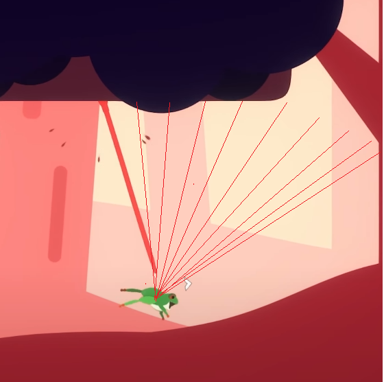

## You are a frog with a very long tongue!

[Froggen](https://bitplayy.itch.io/froggen) is a physics-based platformer where the main mechanic is having a long tongue.
You can use your tongue to grab enemies, grapple around and climb platforms!

It was my second year project for ENTI-UB University, and it was made in about 6 months
with a team of 3 people (including me).



I was the lead developer and artist, and made all the physics and rendering of the
tongue, which was a big endeavour and took a lot of iterations to get right.

## Creating a physics-based tongue

For this game, we wanted to have a physics-based tongue instead of a plain line.
For that, I made use of Unity's physics system. The tongue is made of a varying number of capsules, which get spawned when the player throws the tongue.
Those capsules are attached to each other using hinge joints, while a distance joint is keeping all the capsules within range. 
This setup provides more stability to the tongue, which was an ongoing issue with the project.

At the same time, a lot of emphasis was put on making the tongue easy to control by the player. 
This was achieved by adding an auto-aim system that used raycasts in this circular form:

The idea behind this was to detect the best direction the tongue should go so the player doesn't miss.


Play it now on Itch.io
