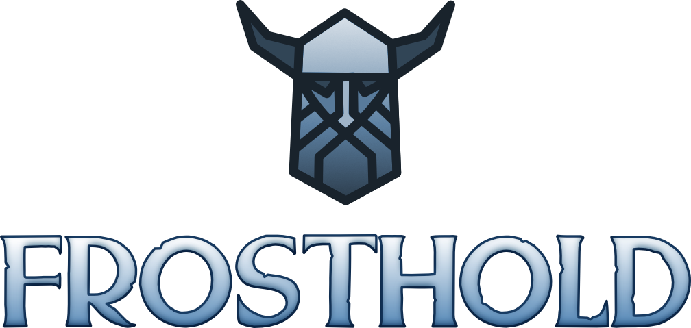
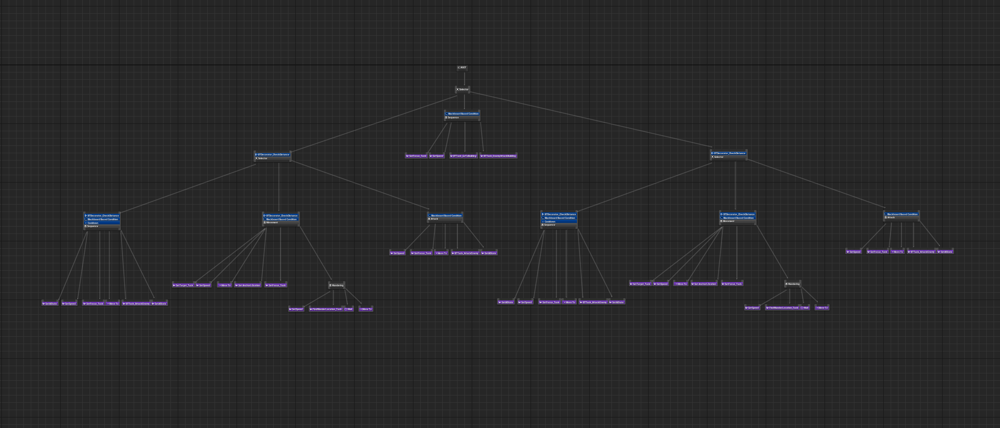
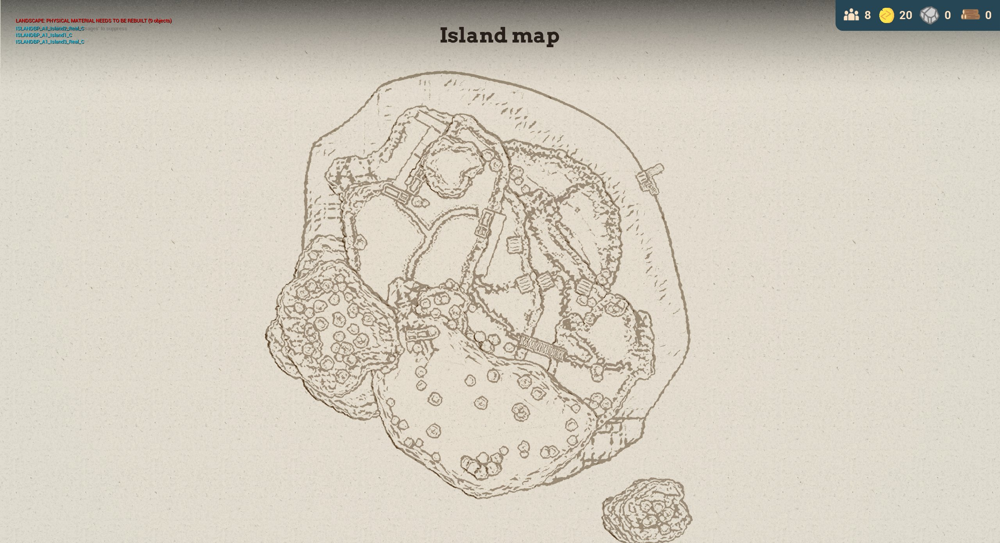

## Build & protect your village

Take control of a grand warrior and rebuild your lost village while cleansing your new found home and defeating the incoming invaders.

Manage your population and resources and spend them on new buildings to progress and defend your new home.

This project is the first 3D project I've made outside of small prototypes. 



*30 sec Trailer*

## My contributions to this project

I was the lead programmer of the project, and settled the rules and basic systems for my other collegues to work with.
I also made the vast majority of art, including the characters and animations. 

### AI

At the same time, I was in charge of the combat system: designing it and implementing it. 
This includes AI using behaviour trees, damage systems and animations, as well as particle and sound effects. 

### Map system

Also, as I really enjoy creating shaders, I did all the custom shaders involved in the game. 
This includes a realtime map system that unfortunately was scratched, but it looked something like this:


Play it now on Itch.io
